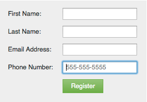

# Hinttekst toevoegen aan een formulierveld {#add-hint-text-to-a-form-field}

Met tips en [instructies](add-tooltip-instructions-to-a-form-field.md) kunnen mensen formulieren invullen. Hieronder wordt beschreven hoe u een tip toevoegt.

>[!NOTE]
>
>**Definitie**
>
>Formulierhints **** zijn tekst in het veld die verdwijnt wanneer de bezoeker in het veld begint te typen.
>
>Formulierinstructies **** zijn kleine knopinfo die wordt weergegeven wanneer de bezoeker de cursor op het veld plaatst.

1. Ga naar **Marketing** **Activiteiten**.

   

1. Selecteer het formulier en klik op **Formulier** bewerken ****.

   

1. Selecteer het veld en voer uw **tip** - **tekst** in.

   

1. Klik op **Voltooien**.

   

1. Klik op **Goedkeuren en Sluiten**.

   

   >[!NOTE]
   >
   >**Herinnering**
   >
   >
   >Vergeet niet het concept [van de bestemmingspagina dat door de formulierwijzigingen is gemaakt,](../../../../product-docs/demand-generation/landing-pages/understanding-landing-pages/approve-unapprove-or-delete-a-landing-page.md) goed te keuren.

   

Kijk eens! Laten we nu wat [instructies](add-tooltip-instructions-to-a-form-field.md) toevoegen.

>[!MORELIKETHIS]
>
>* [Knopinfo-instructies toevoegen aan een formulierveld](add-tooltip-instructions-to-a-form-field.md)

>

