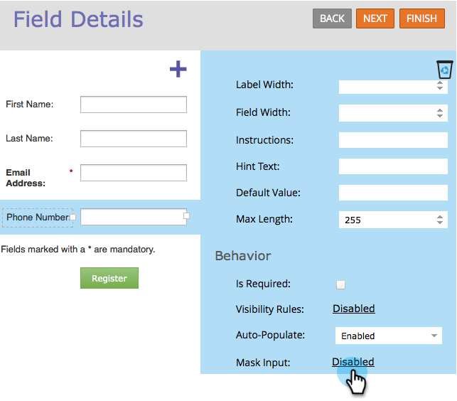

# Invoermaskering toepassen op een veld in een formulier {#apply-input-masking-to-a-field-in-a-form}

U kunt de invoer van de bezoeker beperken met behulp van een invoermasker. U wilt bezoekers bijvoorbeeld wellicht alleen telefoonnummers invoeren in een specifieke notatie.

1. Ga naar **[!UICONTROL Marketing Activities]** .

   

1. Selecteer het formulier en klik op **[!UICONTROL Edit Form]** .

   

1. Selecteer het veld en zorg ervoor dat **[!UICONTROL Field Type]*** is ingesteld op **[!UICONTROL Text]** .

   >[!NOTE]
   >
   >Invoermaskering werkt alleen met **[!UICONTROL Text Field Types]** .

   

1. Klik op de koppeling **[!UICONTROL Mask Input]** .

   

1. Voer het invoermasker in en klik op **[!UICONTROL Save]** .

   

   >[!NOTE]
   >
   >Let op de maskeringsregels. U kunt invoer beperken tot getallen, letters, beide en/of zelfs het aantal ingevoerde tekens beperken.

1. Klik op **[!UICONTROL Finish]**.

   

1. Klik op **[!UICONTROL Approve and Close]**.

   

   Kijk eens! Nu vraagt u de bezoeker om getallen in een specifieke notatie in te voeren.

   

   >[!NOTE]
   >
   >Het is mogelijk dat in het veld vooraf gedefinieerde gebieden niet worden weergegeven, zoals in de bovenstaande afbeelding wordt getoond. Het wordt mogelijk leeg weergegeven totdat de bezoeker de getallen invoert. Vervolgens wordt automatisch de invoernotatie gebruikt die u voor het veld hebt gedefinieerd.

Mooi cool, hè?
