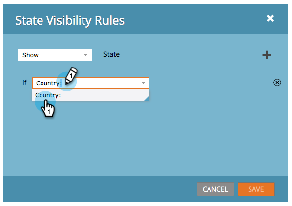

# De zichtbaarheid van een formulierveld dynamisch in-/uitschakelen {#dynamically-toggle-visibility-of-a-form-field}

>[!PREREQUISITES]
>
>* [ voeg een Picklist van het Land aan uw Vorm toe ](/help/marketo/product-docs/demand-generation/forms/form-actions/add-a-country-picklist-to-your-form.md)

Één werkelijk coole eigenschap van de vormen van Marketo is dat u formuliergebieden of [ gebiedsreeksen ](/help/marketo/product-docs/demand-generation/forms/form-fields/add-a-fieldset-to-a-form.md) dynamisch kunt verbergen/tonen.

>[!NOTE]
>
>**Voorbeeld**
>
>In dit voorbeeld, verbergen wij het **gebied van de Staat** tenzij **Land** als &quot;Verenigde Staten wordt geselecteerd.&quot;

1. Ga naar **[!UICONTROL Marketing Activities]** .

   

1. Selecteer het formulier en klik op **[!UICONTROL Edit Form]** .

   

1. Selecteer het veld dat u dynamisch wilt verbergen/weergeven en klik op de koppeling voor **[!UICONTROL Visibility Rules]** .

   

1. Zoek en selecteer het veld waar u een voorwaarde wilt maken.

   

1. Selecteer de operator.

   >[!TIP]
   >
   >Dit is cool omdat u vage gelijken zoals &quot;[!UICONTROL starts with]&quot;kunt kiezen.

   

1. Selecteer de gewenste waarde(n) en klik buiten de vervolgkeuzelijst.

   

   >[!TIP]
   >
   >U kunt meerdere waarden selecteren door erop te klikken terwijl de vervolgkeuzelijst is geopend. U kunt bijvoorbeeld Verenigde Staten en Canada selecteren.

   >[!NOTE]
   >
   >Wij hebben eerder Land in een oogst-lijst gebiedstype omgezet en [ toegevoegd alle landen als waarden ](/help/marketo/product-docs/demand-generation/forms/form-actions/add-a-country-picklist-to-your-form.md).

1. Klik op **[!UICONTROL Save]**.

   

En dat is het! Wanneer mensen dit formulier nu invullen en Verenigde Staten voor land selecteren, wordt het veld Staat dynamisch weergegeven met de opgegeven opties.

>[!IMPORTANT]
>
>Het gedrag van het gebied van de vorm zal foutloos werken wanneer de gebiedswaarden door douanescript gebruikend [ API functies ](https://experienceleague.adobe.com/nl/docs/marketo-developer/marketo/javascriptapi/forms-api-reference){target="_blank"} in Forms 2.0 worden geplaatst/worden bijgewerkt.
>
>Voorwaardelijke velden werken mogelijk niet zoals verwacht als veldwaarden worden gewijzigd door andere externe scripts dan de Forms 2.0 JavaScript API.
