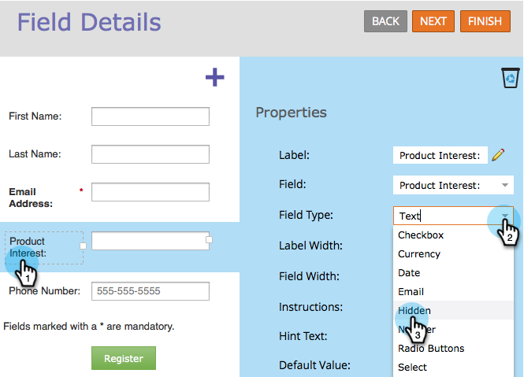

# Een formulierveld instellen als verborgen {#set-a-form-field-as-hidden}

Verborgen formuliervelden kunnen zonder invoer van de bezoeker gegevens vastleggen. Zo werkt dit.

1. Ga naar **[!UICONTROL Marketing Activities]** .

   

1. Selecteer het formulier en klik op **[!UICONTROL Edit Form]** .

   

1. Selecteer het veld en stel **[!UICONTROL Field Type]** in op **[!UICONTROL Hidden].**

   

>[!TIP]
>
>Sneltoets! Nadat u een formulierveld hebt geselecteerd, drukt u op Ctrl+Alt+H om het veld verborgen te maken.

>[!MORELIKETHIS]
>
>[ plaats een Verborgen Waarde van het Gebied van de Vorm ](/help/marketo/product-docs/demand-generation/forms/form-fields/set-a-hidden-form-field-value.md)
