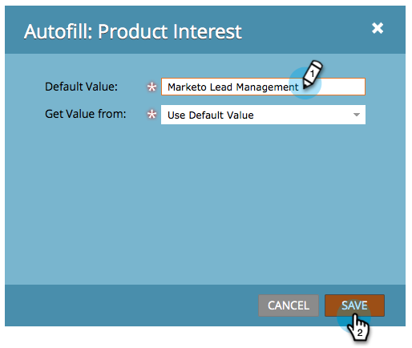

# De waarde van een verborgen formulierveld instellen {#set-a-hidden-form-field-value}

Verborgen velden worden gewoonlijk dynamisch gevuld. Zij worden niet getoond aan de persoon die het formulier invult. Hieronder wordt beschreven hoe u de waarde instelt.

>[!PREREQUISITES]
>
>[Een formulierveld instellen als verborgen](/help/marketo/product-docs/demand-generation/forms/form-fields/set-a-form-field-as-hidden.md)

## Selecteer het veld {#select-the-field}

1. Selecteer het verborgen veld in het formulier en klik op **Bewerken** for **Automatisch vullen**.

   

## Standaardwaarde gebruiken {#use-default-value}

Als u Standaardwaarde gebruiken selecteert, kunt u code toepassen op een specifieke waarde die altijd moet worden gebruikt wanneer dit formulier wordt verzonden. Voer de standaardwaarde in en klik op Opslaan.

## URL-parameter {#url-parameter}

Als u URL-parameters (Query-tekenreeksen) wilt vastleggen vanaf de pagina waarop de persoon zich bevindt bij het invullen van het formulier, kunt u **URL-parameters** om het verborgen veld te vullen.

>[!NOTE]
>
>Parameters zijn nogal technisch, niet? Maar als je ze krijgt, zijn ze machtig. Dit [Wikipedia-pagina over queryreeksen](https://en.wikipedia.org/wiki/Query_string) is wat behulpzaam.

1. Selecteren **URL-parameter** for **Waardetype ophalen**.

   

1. Voer de **Parameternaam** en klik op **Opslaan**.

   

>[!TIP]
>
>U kunt een standaardwaarde invoeren als de URL-parameter niet wordt gevonden.

## Koekjeswaarde {#cookie-value}

Als u gegevens in cookies opslaat, kunt u **Koekjeswaarde** om gegevens op te halen wanneer het formulier wordt verzonden.

1. Selecteren **Koekjeswaarde** for **Waarde ophalen van**.

   

1. Voer de gewenste naam voor de cookieparameter in en klik op **Opslaan**.

   

   >[!TIP]
   >
   >U kunt een standaardwaarde invoeren als de parameter/cookie niet wordt gevonden.

## Refererparameter {#referrer-parameter}

Als u gegevens wilt vastleggen van de pagina waarvan de bezoeker afkomstig is voordat u het formulier invult, kunt u **Refererparameter**.

1. Set **Waarde ophalen van** tot **Refererparameter**.

   

1. Voer de **Parameternaam** die u vanaf de referentie-URL wilt uitlijnen en klik op **Opslaan**.

   

   >[!TIP]
   >
   >U kunt een **Standaardwaarde** als de verwijzingsparameter niet wordt gevonden.

1. Klikken **Voltooien**.

   

1. Klikken **Goedkeuren en Sluiten**.

   
