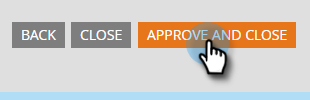

# CAPTCHA inschakelen in Marketo Forms {#enable-captcha-in-marketo-forms}

U kunt [!UICONTROL CAPTCHA] per formulier in-/uitschakelen.

1. Selecteer het gewenste formulier.

   

1. Klik op **[!UICONTROL Edit Draft]** (als het formulier al is goedgekeurd, klikt u op [!UICONTROL Create Draft] ).

   

1. Klik op **[!UICONTROL Form Settings]** en vervolgens op **[!UICONTROL Settings]** .

   

1. Open de vervolgkeuzelijst **[!UICONTROL CAPTCHA]** en selecteer **[!UICONTROL Enabled]** .

   

1. Klik op **[!UICONTROL Finish]**.

   

1. Klik op **[!UICONTROL Approve and Close]**.

   

Het kan een paar minuten duren voordat wijzigingen in deze lijst worden doorgevoerd vanuit Google.

>[!NOTE]
>
>Standaardtekst, inclusief koppelingen naar het privacybeleid van Google en de servicevoorwaarden, worden toegevoegd aan formulieren die geschikt zijn voor CAPTCHA.

>[!MORELIKETHIS]
>
>[ Vestiging reCAPTCHA v3 ](/help/marketo/product-docs/demand-generation/forms/using-captcha/setting-up-recaptcha-v3.md)
