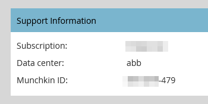

# Instellen [!UICONTROL reCAPTCHA v3] {#setting-up-recaptcha-v3}

ReCAPTCHA v3 is een frictioneloze ervaring die formulierverzendingen scoort op basis van hoe verdacht ze zijn zonder tekst, afbeeldingen of knopuitdagingen te gebruiken. [&#x200B; leer meer &#x200B;](https://developers.google.com/search/blog/2018/10/introducing-recaptcha-v3-new-way-to){target="_blank"}.

## Uw [!UICONTROL Data Center] en [!UICONTROL Munchkin ID] ophalen {#retrieve-your-data-center-and-munchkin-id}

Voor stap 6 in de sectie [!UICONTROL reCAPTCHA v3] Begininstellingen hieronder hebt u de abonnementen [!UICONTROL Data Center] en [!UICONTROL Munchkin ID] van uw Marketo Engage-abonnement nodig. Zo vind je ze.

1. Klik in Marketo op **[!UICONTROL Admin]** .

   

1. Klik op **[!UICONTROL My Account]**.

   

1. Omlaag schuiven naar [!UICONTROL Support Information] .

   

## Oorspronkelijke [!UICONTROL reCAPTCHA v3] instelling {#initial-recaptcha-v3-setup}

De volgende stappen worden uitgevoerd buiten Marketo.

1. Ga naar [&#x200B; https://www.google.com/recaptcha/about/ &#x200B;](https://www.google.com/recaptcha/about/){target="_blank"} en klik op v3 Admin Console.

1. Meld u aan bij of meld u aan bij een Google-account.

1. Klik op de knop [!UICONTROL Create] (+) om een nieuwe toets te maken.

1. Maak een label om de sleutel aan te duiden die voor Marketo Engage moet worden gebruikt.

1. Kies tekst **[!UICONTROL reCAPTCHA v3]** . Marketo Engage ondersteunt momenteel geen reCAPTCHA v2.

1. Voeg elk domein toe dat in het Marketo Engage-abonnement wordt gebruikt. Domeinen die hier niet zijn ingesteld, retourneren fouten op formulieren waarvoor reCAPTCHA is ingeschakeld. Herinner me om de woorden &quot;datacenter&quot;en &quot;munchkinID&quot;met de [&#x200B; gegevens in uw abonnement &#x200B;](#retrieve-your-data-center-and-munchkin-id) te vervangen.

   * app-datacenter.marketo.com
   * munchkinID.mktoweb.com
   * elk domein en alias van de landingspagina dat in het abonnement is geconfigureerd

   >[!NOTE]
   >
   >Als de waarde [!UICONTROL Data Center] van uw account bijvoorbeeld &#39;sjst&#39; is, is het domein dat u voegt op lijst van gewenste personen `app-sjst.marketo.com` . Als uw [!UICONTROL Munchkin ID] 123-ABC-789 is, zou het domein u voegt op lijst van gewenste personen `123-ABC-789.mktoweb.com` zijn.

1. Stel een eigenaar in en voeg een e-mailadres toe waar waarschuwingen over deze service moeten worden ontvangen.

1. Accepteer de Servicevoorwaarden van reCAPTCHA.

1. Klik op **[!UICONTROL Submit]**.

   >[!NOTE]
   >
   >Houd de sleutel van de plaats en geheime sleutel handig voor de configuratie van Marketo Engage.

## CAPTCHA instellen in Marketo Engage {#setting-up-captcha-in-marketo-engage}

>[!IMPORTANT]
>
>Nadat u deze stappen volgt en [&#x200B; CAPTCHA in uw eerste vorm van Marketo &#x200B;](/help/marketo/product-docs/demand-generation/forms/using-captcha/enable-captcha-in-marketo-forms.md){target="_blank"} toelaat, ben zeker om de vorm onmiddellijk te testen aangezien om het even welke soort misconfiguration in de reCAPTCHA opstelling de vorm kan breken.

1. Klik in Marketo op **[!UICONTROL Admin]** .

   

1. Selecteer **[!UICONTROL CAPTCHA]** in de structuur.

   

1. Klik op **[!UICONTROL Edit]** voor [!UICONTROL CAPTCHA] -instellingen.

   

1. Klik op de vervolgkeuzelijst [!UICONTROL CAPTCHA] en kies [!UICONTROL reCAPTCHA v3] .

   

1. Voeg de tags **[!UICONTROL Secret Key]** en **[!UICONTROL Site Key]** in. Klik op **[!UICONTROL Save]** als u klaar bent.

   

>[!MORELIKETHIS]
>
>[&#x200B; laat CAPTCHA in Marketo Forms toe &#x200B;](/help/marketo/product-docs/demand-generation/forms/using-captcha/enable-captcha-in-marketo-forms.md)
