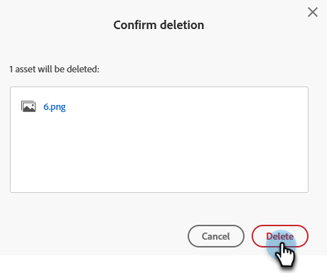

# Een geüploade afbeelding of bestand verwijderen {#delete-an-uploaded-image-or-file}

Het verwijderen van afbeeldingen of bestanden gaat snel en eenvoudig.

>[!CAUTION]
>
>Nadat afbeeldingen/bestanden zijn verwijderd, worden ze volledig uit Marketo Engage verwijderd en kunnen ze niet meer worden hersteld.

1. Ga naar de **[!UICONTROL Design Studio]** .

   

1. Selecteren **[!UICONTROL Images and Files]**

   

1. Zoek en selecteer de gewenste afbeelding/het gewenste bestand. Klik op de vervolgkeuzelijst **[!UICONTROL Image and file actions]** en selecteer **[!UICONTROL Delete]** .

   

1. Controleer of u het juiste bestand hebt geselecteerd en klik op **[!UICONTROL Delete]** .

   

   >[!NOTE]
   >
   >Assets verwijdert niet als ze momenteel worden gebruikt.

>[!MORELIKETHIS]
>
>* [&#x200B; vervangt een Geüploade Beeld of Dossier &#x200B;](/help/marketo/product-docs/demand-generation/images-and-files/replace-an-uploaded-image-or-file.md){target="_blank"}
>* [&#x200B; Onderzoek Geüploade Beelden en Dossiers &#x200B;](/help/marketo/product-docs/demand-generation/images-and-files/search-uploaded-images-and-files.md){target="_blank"}
>* [&#x200B; vind URL van een Geüploade Beeld of Dossier &#x200B;](/help/marketo/product-docs/demand-generation/images-and-files/find-the-url-of-an-uploaded-image-or-file.md){target="_blank"}
