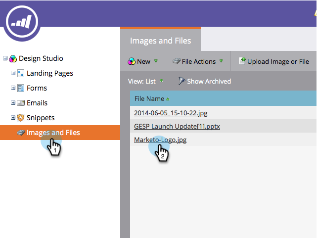

# De URL van een geüploade afbeelding of bestand zoeken {#find-the-url-of-an-uploaded-image-or-file}

Op zoek naar het webadres (URL) van een afbeelding of bestand dat u hebt geüpload? Marketo heeft je bedekt.

1. Ga naar de **Design Studio**.

   

1. Klikken **Afbeeldingen en bestanden** in het linkermenu en selecteer dan het dossier u URL voor wilt.

   

1. De **URL** wordt weergegeven op de detailpagina. Klik met de rechtermuisknop op de knop **URL** en klik op **Kopiëren** in het menu dat wordt weergegeven.

   

Geef jezelf een pat op de rug voor een goed geklaagde baan!

>[!MORELIKETHIS]
>
>[Een geüploade afbeelding of bestand vervangen](/help/marketo/product-docs/demand-generation/images-and-files/replace-an-uploaded-image-or-file.md)
