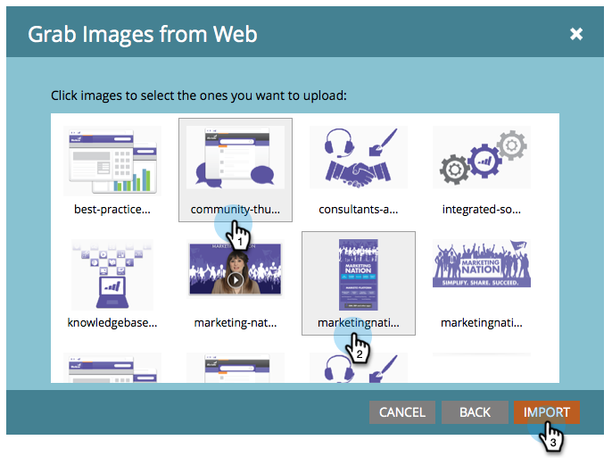

# De afbeeldingen ophalen van een webpagina {#grab-the-images-from-a-web-page}

Als u afbeeldingen van een webpagina wilt toevoegen, kopieert u het webadres (URL) van de pagina met de gewenste afbeeldingen en voert u de volgende eenvoudige stappen uit.

1. Ga naar **[!UICONTROL Design Studio]** .

   

1. Klik op **[!UICONTROL New]** en **[!UICONTROL Grab Images from Web]** .

   

1. Selecteer de map **[!UICONTROL Images and Files]** , plak het webadres (URL) in het tekstvak URL en klik op **[!UICONTROL Next]** .

   

   >[!NOTE]
   >
   >Deze functie werkt niet met URL&#39;s die rechtstreeks naar een afbeelding verwijzen. Gebruik de URL van de webpagina die de afbeeldingen bevat.

1. Selecteer de afbeeldingen die u wilt toevoegen en klik op **[!UICONTROL Import]** .

   

1. Uw afbeeldingen worden nu geïmporteerd en kunnen worden gebruikt in e-mails en landingspagina&#39;s.

   

1. U kunt alle beschikbare afbeeldingen weergeven in **[!UICONTROL Images and Files]** .

   

Mooi werk, beeldmeester!

>[!MORELIKETHIS]
>
>* [&#x200B; voegt Beelden en Dossiers aan Marketo &#x200B;](/help/marketo/product-docs/demand-generation/images-and-files/add-images-and-files-to-marketo.md) toe
>* [&#x200B; organiseer Uw Beelden en Dossiers gebruikend Omslagen &#x200B;](/help/marketo/product-docs/demand-generation/images-and-files/organize-your-images-and-files-using-folders.md)
>* [&#x200B; vind URL van een Geüploade Beeld of Dossier &#x200B;](/help/marketo/product-docs/demand-generation/images-and-files/find-the-url-of-an-uploaded-image-or-file.md)
>* [&#x200B; upload Beelden en Dossiers van Doos &#x200B;](/help/marketo/product-docs/demand-generation/images-and-files/upload-images-and-files-from-box.md)
