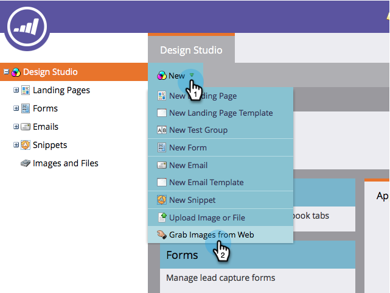

# De afbeeldingen ophalen van een webpagina {#grab-the-images-from-a-web-page}

Als u afbeeldingen van een webpagina wilt toevoegen, kopieert u het webadres (URL) van de pagina met de gewenste afbeeldingen en voert u de volgende eenvoudige stappen uit.

1. Ga naar **Design Studio**.

   

1. Klik op **New** en **Grab Images from Web**.

   

1. Selecteer de map **Afbeeldingen en bestanden**, plak het webadres (URL) in het tekstvak URL en klik op **Volgende**.

   

   >[!NOTE]
   >
   >Deze functie werkt niet met URL&#39;s die rechtstreeks naar een afbeelding verwijzen. Gebruik de URL van de webpagina die de afbeeldingen bevat.

1. Selecteer de afbeeldingen die u wilt toevoegen en klik op **Importeren**.

   

1. Uw afbeeldingen worden nu geïmporteerd en kunnen worden gebruikt in e-mails en landingspagina&#39;s.

   

1. U kunt al uw beschikbare beelden in **Beelden en Dossiers** zien.

   

Mooi werk, afbeelding master!

>[!MORELIKETHIS]
>
>* [Afbeeldingen en bestanden toevoegen aan markeerteken](/help/marketo/product-docs/demand-generation/images-and-files/add-images-and-files-to-marketo.md)
>* [Uw afbeeldingen en bestanden ordenen met mappen](/help/marketo/product-docs/demand-generation/images-and-files/organize-your-images-and-files-using-folders.md)
>* [De URL van een geüploade afbeelding of bestand zoeken](/help/marketo/product-docs/demand-generation/images-and-files/find-the-url-of-an-uploaded-image-or-file.md)
>* [Afbeeldingen en bestanden uploaden uit vak](/help/marketo/product-docs/demand-generation/images-and-files/upload-images-and-files-from-box.md)

