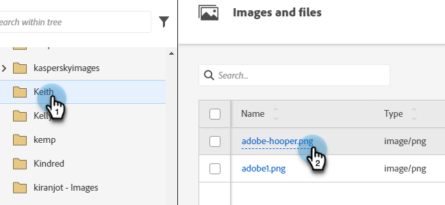
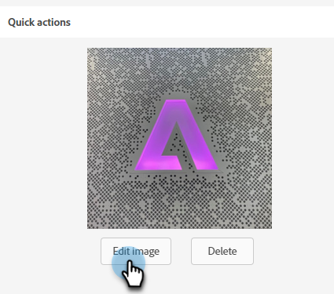
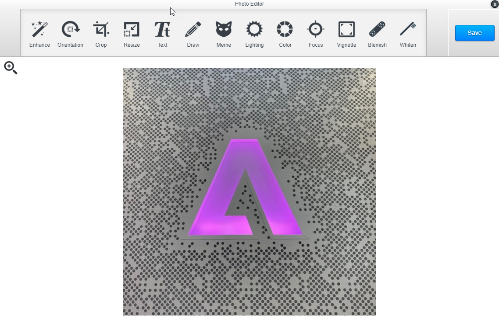

# Afbeeldingseditor {#image-editor}

Met de afbeeldingseditor kunt u in Marketo Engage snel lichte bewerkingen op uw afbeeldingen uitvoeren.

1. Ga naar de **[!UICONTROL Design Studio]** .

   

1. Zoek en selecteer de afbeelding.

   

1. Klik op **[!UICONTROL Edit Image]** .

   

1. U kunt kiezen uit verschillende functies in de werkbalk bovenaan. Klik op **[!UICONTROL Save]** als u klaar bent.

   
