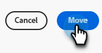

# Uw afbeeldingen en bestanden ordenen met mappen {#organize-your-images-and-files-using-folders}

Als u mappen maakt, kunt u afbeeldingen en bestanden verplaatsen, alleen de gewenste set afbeeldingen bekijken en rechtstreeks naar een specifieke map uploaden.

1. Ga naar de **[!UICONTROL Design Studio]** .

   

1. Klik met de rechtermuisknop op **[!UICONTROL Images and Files]** en selecteer **[!UICONTROL New folder]** .

   

1. Geef de map een naam en klik op **[!UICONTROL Create]** .

   

1. Ga terug naar **[!UICONTROL Images and Files]** en selecteer het element dat u wilt verplaatsen. Klik op de vervolgkeuzelijst **[!UICONTROL Image and file actions]** en selecteer **[!UICONTROL Move]** .

   

1. Selecteer de gewenste map.

   

1. Klik **M  bewegen**.

   

>[!MORELIKETHIS]
>
>[&#x200B; Onderzoek Geüploade Beelden en Dossiers &#x200B;](/help/marketo/product-docs/demand-generation/images-and-files/search-uploaded-images-and-files.md){target="_blank"}
