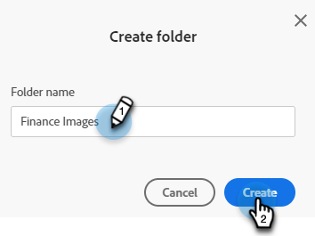
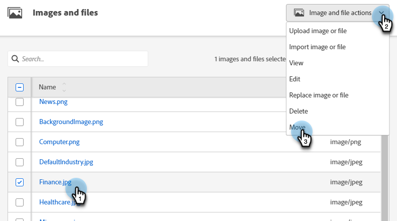
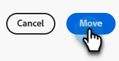

# Uw afbeeldingen en bestanden ordenen met mappen {#organize-your-images-and-files-using-folders}

Als u mappen maakt, kunt u afbeeldingen en bestanden verplaatsen, alleen de gewenste set afbeeldingen bekijken en rechtstreeks naar een specifieke map uploaden.

1. Ga naar de **[!UICONTROL Design Studio]**.

   

1. Klikken met rechtermuisknop aan op **[!UICONTROL Images and Files]** en selecteert u **[!UICONTROL New folder]**.

   

1. Geef uw map een naam en klik op **[!UICONTROL Create]**.

   

1. Ga terug naar **[!UICONTROL Images and Files]** en selecteert u het element dat u wilt verplaatsen. Klik op de knop **[!UICONTROL Image and file actions]** vervolgkeuzelijst en selecteer **[!UICONTROL Move]**.

   

1. Selecteer de gewenste map.

   

1. Klikken **Mverhuizen**.

   

>[!MORELIKETHIS]
>
>[Geüploade afbeeldingen en bestanden doorzoeken](/help/marketo/product-docs/demand-generation/images-and-files/search-uploaded-images-and-files.md){target="_blank"}
