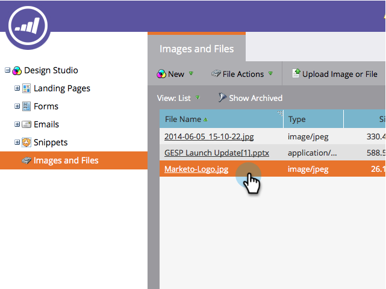

# Een geüploade afbeelding of bestand vervangen {#replace-an-uploaded-image-or-file}

1. Ga naar de **Design Studio**.

   

1. Klikken **Afbeeldingen en bestanden** Selecteer vervolgens het bestand dat u wilt vervangen.

   

   >[!TIP]
   >
   >U kunt ook [geüploade afbeeldingen of bestanden zoeken](/help/marketo/product-docs/demand-generation/images-and-files/search-uploaded-images-and-files.md).

1. Klikken **Bestandshandelingen** en selecteert u **Afbeelding of bestand vervangen**.

   

1. Blader naar het bestand op uw computer dat het huidige bestand vervangt en selecteer het.

   

   >[!NOTE]
   >
   >Als u geen bestand uit een gedeelde map kunt selecteren, slaat u dat bestand op de vaste schijf op en kiest u het.

1. Controleer of het bestand naast **Bestand kiezen** is correct, dan klik **Vervangen**.

   

>[!NOTE]
>
>De naam van het vervangende bestand wordt gewijzigd zodat deze overeenkomt met de vorige bestandsnaam.

Je hebt het gedaan!

>[!MORELIKETHIS]
>
>* [Geüploade afbeeldingen en bestanden zoeken](/help/marketo/product-docs/demand-generation/images-and-files/search-uploaded-images-and-files.md)
>* [De URL van een geüploade afbeelding of bestand zoeken](/help/marketo/product-docs/demand-generation/images-and-files/find-the-url-of-an-uploaded-image-or-file.md)
