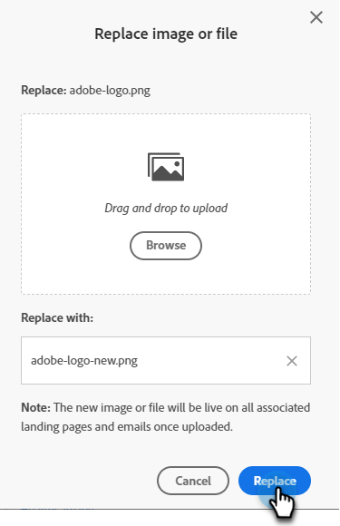

# Een geüploade afbeelding of bestand vervangen {#replace-an-uploaded-image-or-file}

1. Ga naar de **[!UICONTROL Design Studio]**.

   

1. Klik op **[!UICONTROL Images and Files]**.

   

1. Selecteer het element dat u wilt vervangen. Klik op de knop **[!UICONTROL Image and file actions]** vervolgkeuzelijst en selecteer **[!UICONTROL Replace image or file]**.

   

1. Sleep of blader naar de computer voor de vervangende afbeelding of het vervangende bestand.

   

   >[!NOTE]
   >
   >Het vervangende bestandstype moet hetzelfde zijn als het origineel (bijvoorbeeld .jpg)

1. Nadat u de vervangende afbeelding/het vervangende bestand hebt geselecteerd, klikt u op **[!UICONTROL Replace]**.

   

   >[!NOTE]
   >
   >De naam van het vervangende bestand wordt gewijzigd zodat deze overeenkomt met de naam van het vorige bestand.

Goed gedaan!

>[!MORELIKETHIS]
>
>* [Geüploade afbeeldingen en bestanden doorzoeken](/help/marketo/product-docs/demand-generation/images-and-files/search-uploaded-images-and-files.md){target="_blank"}
>* [De URL van een geüploade afbeelding of bestand zoeken](/help/marketo/product-docs/demand-generation/images-and-files/find-the-url-of-an-uploaded-image-or-file.md){target="_blank"}
