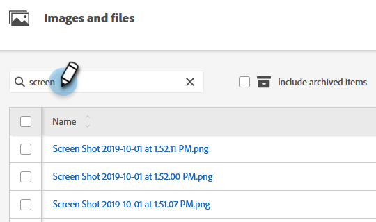

# Geüploade afbeeldingen en bestanden doorzoeken {#search-uploaded-images-and-files}

Leer hoe u naar een afbeelding of bestand zoekt.

1. Ga naar de **[!UICONTROL Design Studio]** .

   

1. Klik op **[!UICONTROL Images and Files]** voor de volledige lijst met alle geüploade bestanden.

   

1. In het vakje van het Onderzoek, typ het woord dat het dossier met begint en **raakt** binnengaan.

   

>[!NOTE]
>
>Bij het zoeken naar afbeeldingen en bestanden wordt alleen de functie &quot;Beginnen met&quot; gebruikt.

>[!MORELIKETHIS]
>
>* [ vervangt een Geüploade Beeld of Dossier ](/help/marketo/product-docs/demand-generation/images-and-files/replace-an-uploaded-image-or-file.md){target="_blank"}
>* [ organiseer Uw Beelden en Dossiers gebruikend Omslagen ](/help/marketo/product-docs/demand-generation/images-and-files/organize-your-images-and-files-using-folders.md){target="_blank"}
