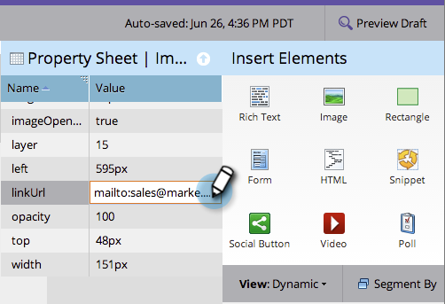

# Voeg een Verbinding aan een Vrije Vorm het Bestaan Beeld van de Pagina toe {#add-a-link-to-a-free-form-landing-page-image}

>[!PREREQUISITES]
>
>[Een afbeelding toevoegen aan een openingspagina met vrije vorm](/help/marketo/product-docs/demand-generation/landing-pages/free-form-landing-pages/add-an-image-to-a-free-form-landing-page.md)

>[!NOTE]
>
>Dit geldt alleen voor landingspagina&#39;s met vrije vorm.

1. Selecteer de afbeelding die u aan de bestemmingspagina hebt toegevoegd en vouw de **Eigenschappenblad.**

   

1. Typ uw mailto-koppeling in het dialoogvenster **Koppel-URL.**

   

   Geweldig werk! Je hebt nu een afbeelding als een mailto-koppeling op de openingspagina van Marketo.

   
