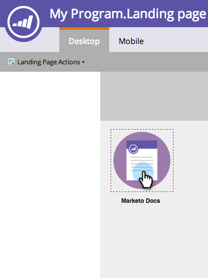
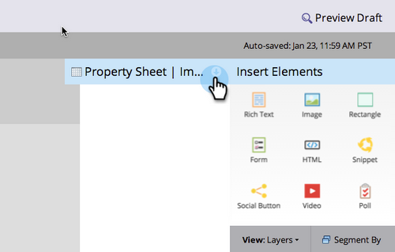

# Een koppeling toevoegen aan een afbeelding in een openstaande pagina {#add-a-link-to-an-image-in-a-free-form-landing-page}

Wilt u een afbeelding op uw bestemmingspagina koppelen aan een andere pagina of site? Zo gaat het.

>[!PREREQUISITES]
>
>[ voeg een Beeld aan een Vrije-Vorm het Landen Pagina toe ](/help/marketo/product-docs/demand-generation/landing-pages/free-form-landing-pages/add-an-image-to-a-free-form-landing-page.md)

1. Klik op de afbeelding waaraan u een koppeling wilt toevoegen.

   

1. Vouw de **[!UICONTROL Property Sheet]** uit.

   

1. Kopieer of typ de koppeling naar het vak **[!UICONTROL linkUrl]** .

   

   Gefeliciteerd! U hebt nu met succes een verbinding aan een beeld op uw landende pagina toegevoegd. U kunt nu [ voorproef de pagina ](/help/marketo/product-docs/demand-generation/landing-pages/landing-page-actions/preview-a-landing-page.md) om het in actie te zien.

>[!TIP]
>
>Test altijd uw pagina&#39;s!
