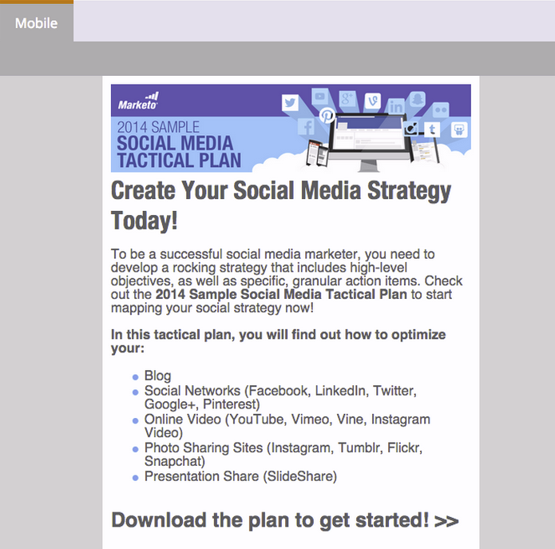

# Een mobiele weergave toevoegen voor uw openingsbestemmingspagina {#add-a-mobile-view-for-your-free-form-landing-page}

Het is eenvoudig om uw gratis bestemmingspagina&#39;s er goed uit te laten zien op een smartphone.

>[!NOTE]
>
>De mobiele weergave werkt op schermen met een breedte van 480 px (of minder). Met andere woorden: smartphones. Hier is meer [ info over apparatenresoluties ](https://www.mydevice.io/).

1. Ga naar **[!UICONTROL Marketing Activities]** .

   

1. Selecteer een landingspagina met vrije vorm.

   

1. Klik op **[!UICONTROL Edit Draft]**.

   

1. Klik op de tab **[!UICONTROL Mobile]** .

   

1. Klik op **[!UICONTROL Activate]**.

   

   >[!CAUTION]
   >
   >Mogelijk moet de sjabloon met de vrije vorm worden bijgewerkt. Als u dat bericht ziet, lees snel over hoe te [ een bestaand vrij-vorm het landen paginamalplaatje mobiel ](/help/marketo/product-docs/demand-generation/landing-pages/landing-page-templates/make-an-existing-free-form-landing-page-template-mobile-compatible.md) maken.

1. Geweldig! U hebt nu de mobiele versie van uw bestemmingspagina geactiveerd. Klik op **[!UICONTROL Close]**.

   

   U kunt nu [ uw mobiele mening ](/help/marketo/product-docs/demand-generation/landing-pages/free-form-landing-pages/customize-mobile-view-for-your-free-form-landing-page.md) aanpassen.

   
