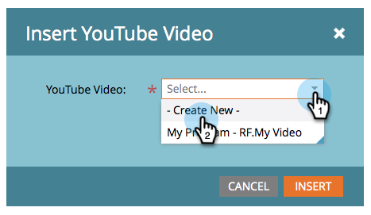

# Een video toevoegen aan een openingspagina met vrije vorm {#add-a-video-to-a-free-form-landing-page}

Plaats video&#39;s met opties voor sociaal delen op de bestemmingspagina&#39;s.

>[!AVAILABILITY]
>
>Niet alle klanten hebben deze functionaliteit aangeschaft. Neem contact op met je verkoper voor meer informatie.

1. Navigeer naar de landingspagina van uw vrije vorm en klik **Concept bewerken**.

   

1. Slepen over **Video** van de elementen aan de rechterkant.

   

1. Selecteren **Nieuw maken** in het keuzemenu.

   

   >[!NOTE]
   >
   >De **Nieuw maken** Deze functie wordt alleen weergegeven in marketingactiviteiten. is niet beschikbaar in Design Studio. Alleen al gemaakte video&#39;s zijn beschikbaar in Design Studio. U kunt echter wel een gedeelde video maken _binnen een programma_ door **Nieuw** > **Nieuw lokaal element**. U kunt het dan van drop-down selecteren, zoals hier getoond.

1. Voer de URL van de YouTube-video in en geef uw video een naam. Onder de Kloon van drop-down uitgezochte **Geen** en klik vervolgens op **Invoegen**.

   

>[!TIP]
>
>Als u tijd wilt besparen, kunt u de opdracht **Klonen uit** Hiermee kopieert u alle instellingen van een bestaande gedeelde video.

Gefeliciteerd.  U hebt een gedeelde video toegevoegd aan de openingspagina. Goedkeuren van de bestemmingspagina en uw video delen is live. U kunt ook [de openingspagina naar Facebook publiceren](/help/marketo/product-docs/demand-generation/facebook/publish-landing-pages-to-facebook.md) of [video delen op uw website plaatsen](/help/marketo/product-docs/demand-generation/social/social-functions/deploy-social-on-your-website.md).

>[!MORELIKETHIS]
>
>U bent klaar, maar u kunt de montages van uw videoaandeel indien nodig veranderen. Beginnen met  [de deelstroom aanpassen](/help/marketo/product-docs/demand-generation/social/configuring-social-actions/customize-video-share-flow.md) (wanneer en waar de aandeelherinnering opent).
