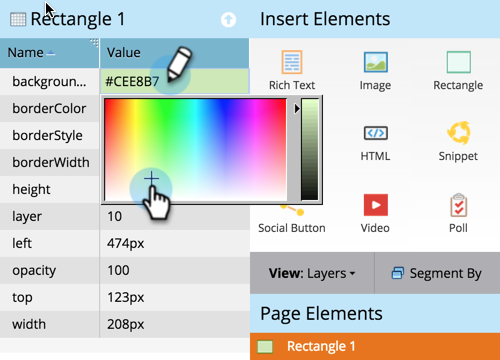

# Een rechthoek toevoegen aan een vrije landingspagina {#adding-a-rectangle-to-a-free-form-landing-page}

Rechthoeken op bestemmingspagina&#39;s zijn ideaal voor het benadrukken van een gebied van de tekst.

1. Selecteer een landingspagina in een vrije vorm en klik op **[!UICONTROL Edit Draft]** .

   

   >[!NOTE]
   >
   >De landingspaginaontwerper met vrije vorm wordt in een nieuw venster geopend.

1. Sleep over het element **[!UICONTROL Rectangle]** .

   

1. Selecteer de rechthoek en gebruik **[!UICONTROL Property Sheet]** om de gewenste wijzigingen aan te brengen.

   >[!TIP]
   >
   >U kunt de rechthoek verplaatsen en vergroten of verkleinen door te slepen. Probeer ook de pijlen op het toetsenbord! Tip: druk op Shift en Pijl om de rechthoek 10 px tegelijk te verplaatsen.

   

Gefeliciteerd! U kunt nu rechthoeken maken op uw openstaande bestemmingspagina&#39;s.
