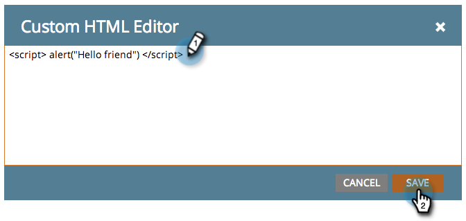

# Aangepaste HTML toevoegen aan een openingspagina met vrije vorm {#adding-custom-html-to-a-free-form-landing-page}

U kunt aangepaste scripts, CSS of andere HTML toevoegen om pagina&#39;s te landen.

>[!NOTE]
>
>Marketo Engage Support is niet ingesteld als hulp bij het oplossen van problemen met aangepaste HTML. Voor hulp van HTML raadpleegt u een webontwikkelaar.

1. Selecteer de openingspagina en klik op **[!UICONTROL Edit Draft]** .

   

1. In de het landen paginaredacteur, sleep in het **HTML** element.

   

1. Voer uw aangepaste HTML-code in en klik op **[!UICONTROL Save]** .

   

Mooi! Plaats de gewenste scripts of CSS.

>[!TIP]
>
>Test waar mogelijk uw aangepaste HTML-bron in een lokale omgeving voordat u deze implementeert op een bestemmingspagina.

>[!CAUTION]
>
>Als uw aangepaste HTML niet-rendert (zoals een onzichtbare JavaScript-functie of CSS), plaatst u het element op een gedenkwaardige locatie, zoals linksboven. De omtrek van het element is alleen zichtbaar wanneer u in het gebied klikt.
