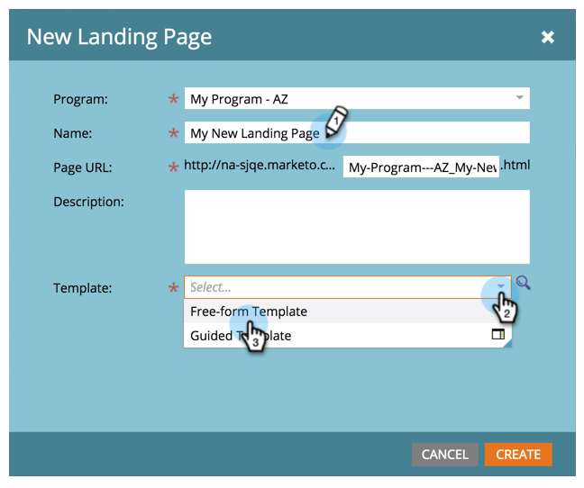

# Een vrije bestemmingspagina maken {#create-a-free-form-landing-page}

Lege bestemmingspagina&#39;s kunnen worden gemaakt als lokale elementen van een programma of in de [!UICONTROL Design Studio] die globaal worden gebruikt.

>[!NOTE]
>
>De modi van de bestemmingspagina worden bepaald door hun sjabloon. [ leer meer ](/help/marketo/product-docs/demand-generation/landing-pages/understanding-landing-pages/understanding-free-form-vs-guided-landing-pages.md) over vrije-vorm en geleide het landen paginasjablonen.

## Een vrije bestemmingspagina maken in een programma {#create-a-free-form-landing-page-in-a-program}

1. Ga naar **[!UICONTROL Marketing Activities]** .

   

1. Klik op uw programma.

   

1. Klik op **[!UICONTROL New]**. Selecteer **[!UICONTROL New Local Asset]** .

   

1. Klik op **[!UICONTROL Landing Page]** .

   

1. Geef de landingspagina een naam en kies een sjabloon met een vrije vorm in de vervolgkeuzelijst.

   >[!NOTE]
   >
   >Sjablonen zonder pictogram zijn vrij. Met vrije-formuliersjablonen kunt u deze volledig aanpassen.

   

1. Klik op **[!UICONTROL Create]**.

   

>[!TIP]
>
>De URL wordt automatisch samengesteld op basis van de naam van het programma en de landingspagina. Als u de URL wilt wijzigen, bewerkt u het veld **[!UICONTROL Page URL]** .

## Een vrije bestemmingspagina maken in Design Studio {#create-a-free-form-landing-page-in-design-studio}

1. Ga naar de **[!UICONTROL Design Studio]** .

   

1. Klik op **[!UICONTROL New]** en vervolgens op **[!UICONTROL New Landing Page]** .

   

1. Geef de landingspagina een naam en kies een sjabloon met een vrije vorm in de vervolgkeuzelijst.

   

1. Klik op **[!UICONTROL Create]**.

   

>[!TIP]
>
>Schakel &quot;[!UICONTROL Open landing page editor for new page]&quot; uit als u niet wilt dat de editor direct wordt geopend nadat u op **[!UICONTROL Create]** hebt geklikt.
