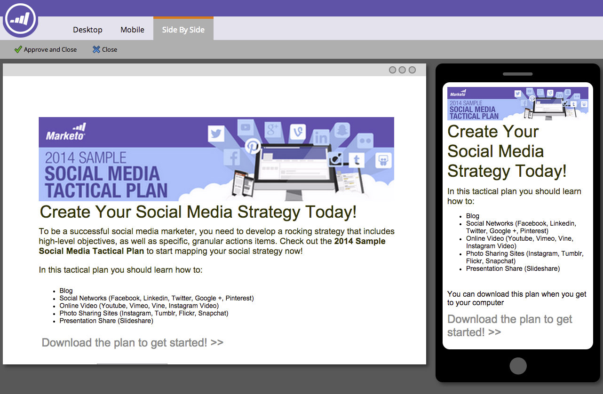

# De mobiele weergave aanpassen voor uw openingspagina {#customize-mobile-view-for-your-free-form-landing-page}

>[!PREREQUISITES]
>
>[Een mobiele weergave toevoegen voor uw openingsbestemmingspagina](/help/marketo/product-docs/demand-generation/landing-pages/free-form-landing-pages/add-a-mobile-view-for-your-free-form-landing-page.md)

De mobiele weergave van de openstaande landingspagina is meestal automatisch, maar u kunt de weergave aanpassen. Zo gaat het.

1. Selecteer de landingspagina van de vrije vorm.

   

1. Klikken **Concept bewerken**.

   

1. Klik op de knop **Mobiel** tab.

   

## Mobiele vs. desktopweergave {#mobile-vs-desktop-view}

Onder Pagina-elementen ziet u een  (bureaublad) en een  (mobiel) pictogram. Hierdoor kunt u verschillende elementen dynamisch tonen/verbergen.

Standaard wordt alles in de bureaubladweergave weergegeven in de mobiele weergave.

>[!NOTE]
>
>Rechthoeken worden niet weergegeven in de mobiele weergave.

## Belangrijke dingen die u moet weten: {#important-things-to-know}

* Afbeeldingen worden breder dan uw mobiele apparaat. Als u kleinere afbeeldingen wilt, trekt u het tekstelement met tekstopmaak in en voegt u de afbeelding daar toe.
* Gebruik alleen Forms 2.0-formulieren. Ze reageren en passen zich automatisch aan.
* Slechts één malplaatjeelement is editable, BODY#body (Mobiel). U kunt dit gebruiken om de achtergrondkleur te veranderen.

  

## Een element verbergen in de mobiele weergave {#hide-an-element-from-the-mobile-view}

>[!TIP]
>
>Minder is meer op mobiel. Gebruik minder woorden voor gelukkigere klanten.

1. Als u een element wilt verbergen, klikt u op het bijbehorende selectievakje onder de kolom Mobiel.

   

1. Perfect! Dat element is dan niet meer zichtbaar in uw mobiele weergave.

   

## Een element toevoegen aan de mobiele weergave {#add-an-element-to-the-mobile-view}

>[!TIP]
>
>Maak speciale (kortere) inhoud alleen voor de mobiele weergave.

1. Als u een element wilt toevoegen, sleept u het naar de landingspagina in vrije vorm.

   

   Zorg ervoor dat het element is ingesteld op alleen weergave in de mobiele weergave.

   

>[!TIP]
>
>De mobiele weergave kan ook een andere rangschikking van pagina-elementen hebben. U kunt de objecten verplaatsen op de landingspagina in vrije vorm of de objecten in de lijst onder opnieuw rangschikken **Pagina-elementen** slepen en neerzetten gebruiken.

## Voorbeeld van mobiele weergave {#preview-mobile-view}

1. Klikken **Concept voorvertonen**.

   

1. Wil je iets cool zien? Selecteren **Naast elkaar**.

   

1. U kunt nu de desktopversie en de mobiele versie van uw bestemmingspagina&#39;s tegelijk zien!

   

1. Als je het leuk vindt, klik dan op **Goedkeuren en Sluiten**.

   

   >[!NOTE]
   >
   >De voorvertoning is niet interactief. Elke smartphone geeft dingen een beetje anders weer. We raden u aan een voorvertoning van de bestemmingspagina weer te geven op een paar apparaten om precies te zien hoe de bestemmingspagina zich gedraagt.

Veel plezier!

>[!MORELIKETHIS]
>
>[Een bestaande landingspaginasjabloon in vrije vorm geschikt maken voor mobiele apparaten](/help/marketo/product-docs/demand-generation/landing-pages/landing-page-templates/make-an-existing-free-form-landing-page-template-mobile-compatible.md)
