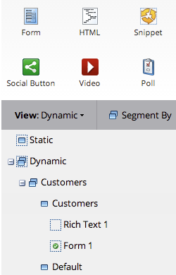

# Dynamische inhoud gebruiken in een openingspagina met vrije vorm {#use-dynamic-content-in-a-free-form-landing-page}

Wanneer u dynamische inhoud gebruikt in bestemmingspagina&#39;s, krijgt uw publiek gerichte informatie.

>[!PREREQUISITES]
>
>* [Een segmentatie maken](../../../../product-docs/personalization/segmentation-and-snippets/segmentation/create-a-segmentation.md)
>* [Een vrije bestemmingspagina maken](create-a-free-form-landing-page.md)
>* [Een nieuw formulier toevoegen aan een openingspagina met vrije vorm](add-a-new-form-to-a-free-form-landing-page.md)

>

## Segmentering toevoegen {#add-segmentation}

1. Ga naar **marketingactiviteiten**.

   

   Selecteer de bestemmingspagina en klik op Concept bewerken.

   

   Klik op Segment op.

   

   Voer de naam van de segmentatie in en klik op Opslaan.

   

   Uw segmentatie en zijn segmenten verschijnen onder Dynamisch op het recht.

   

>[!NOTE]
>
>Alle landende pagina-elementen zijn standaard statisch.

## Element dynamisch maken {#make-element-dynamic}

1. Sleep de dynamische inhoudselementen van onder **Statisch** aan **Dynamisch.**

   

1. U kunt elementen ook **Statisch** of **Dynamisch** maken van de **Montages van het element.**

   

## Dynamische inhoud toepassen {#apply-dynamic-content}

1. Selecteer een element onder een segment, klik op het instellingenpictogram en klik op **Bewerken**. Herhaal dit voor elk segment.

   

1. Een groen vinkje geeft de inhoud aan die specifiek is voor dat segment. Een lege waarde geeft de standaardsegmentinhoud aan.

   

>[!CAUTION]
>
>Wijzigingen in het inhoudsblok Standaardsegment worden toegepast op alle segmenten.

>[!TIP]
>
>Maak een standaardopeningspagina voordat u de inhoud voor de verschillende segmenten wijzigt.

Voila! U kunt nu de doelinhoud verzenden.

>[!NOTE]
>
>**Verwante artikelen**
>
>* [Een voorvertoning van een bestemmingspagina weergeven met dynamische inhoud](../../../../product-docs/demand-generation/landing-pages/landing-page-actions/preview-a-landing-page-with-dynamic-content.md)
>* [Dynamische inhoud gebruiken in een e-mail](../../../../product-docs/email-marketing/general/functions-in-the-editor/using-dynamic-content-in-an-email.md)

>

