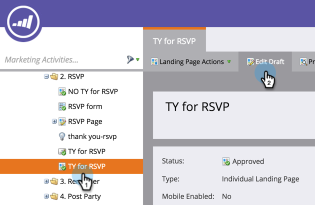

# Hulplijnen gebruiken voor ontwerpen vrije bestemmingspagina {#use-guides-for-free-form-landing-page-design}

Bij het ontwerpen van een openstaande landingspagina kunt u hulplijnen gebruiken om de componenten uit te lijnen.

>[!NOTE]
>
>Hulplijnen zijn alleen beschikbaar in de bestemmingspagina-editor van **[!UICONTROL Free-form]** .

1. Selecteer een **[!UICONTROL Landing Page]** en klik op **[!UICONTROL Edit Draft]** .

   

1. Klik op **[!UICONTROL Landing Page Actions]** en selecteer **[!UICONTROL Show Guides]** .

   

1. Op het canvas verschijnt een verticale en horizontale hulplijn. Gebruik de cursor om deze te verplaatsen.

   

1. Sleep een object over de lijn. Laat gaan wanneer de lijn in breedte verdubbelt en het voorwerp aan de gids zal breken.

   

   Uitgelijnde objecten zijn gemakkelijk in de ogen!
