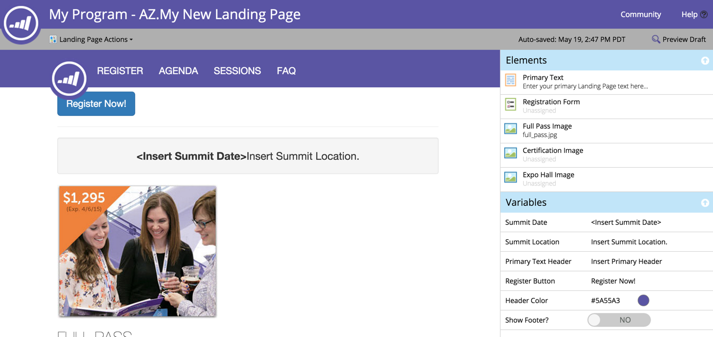

# Een afbeelding toevoegen aan een bestemmingspagina met instructies {#add-an-image-to-a-guided-landing-page}

In tegenstelling tot de openstaande bestemmingspagina&#39;s, hebben de geleide landingspagina&#39;s vooraf gedefinieerde, vergrendelde ruimten waar u afbeeldingen toevoegt.

1. Selecteer een geleide landingspagina. Klik op **[!UICONTROL Edit Draft]**.

   

1. Klik op de afbeelding die u wilt bewerken. De plaatsaanduiding van het element wordt verlicht in het canvas van de bestemmingspagina.

   

1. Selecteer de gewenste afbeelding en klik op **[!UICONTROL Insert]** .

   

1. De inhoud wordt weergegeven in de plaatsaanduiding van het element.

   >[!NOTE]
   >
   >De manier waarop de afbeeldingsgrootte wordt gewijzigd, is afhankelijk van de sjabloon. Leer meer over [&#x200B; Geleide Begeleidende Malplaatjes van de Pagina &#x200B;](/help/marketo/product-docs/demand-generation/landing-pages/landing-page-templates/create-a-guided-landing-page-template.md).

   

   >[!TIP]
   >
   >Het opgeven van een koppeling voor een afbeelding in de editor wordt momenteel niet ondersteund. Gebruik in plaats hiervan een tekstelement met tekstopmaak.
