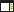
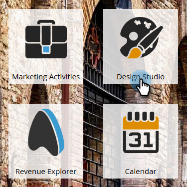

# Een bestemmingspagina met instructies maken {#create-a-guided-landing-page}

>[!NOTE]
>
>De modi van de bestemmingspagina worden bepaald door hun sjabloon. [ leer meer ](/help/marketo/product-docs/demand-generation/landing-pages/understanding-landing-pages/understanding-free-form-vs-guided-landing-pages.md) over vrije-vorm en geleide het landen paginasjablonen.

>[!PREREQUISITES]
>
>Om een douanemalplaatje te gebruiken, moet u eerst [ een geleide het landen paginamalplaatje ](/help/marketo/product-docs/demand-generation/landing-pages/landing-page-templates/create-a-guided-landing-page-template.md) creëren.

## Een pagina met instructies-landingen maken in een programma {#create-a-guided-landing-page-in-a-program}

Geleide landingspagina&#39;s kunnen worden gemaakt als lokale elementen van een programma of in de [!UICONTROL Design Studio] die globaal worden gebruikt.

1. Ga naar **[!UICONTROL Marketing Activities]** .

   

1. Selecteer uw programma.

   

1. Klik op de vervolgkeuzelijst **[!UICONTROL New]** . Selecteer **[!UICONTROL New Local Asset]**.

   

1. Selecteer **[!UICONTROL Landing Page]**.

   

1. Geef de landingspagina een naam. Klik op de vervolgkeuzelijst **[!UICONTROL Template]** en selecteer **[!UICONTROL Guided Template]** .

   >[!NOTE]
   >
   >De geleide het landen paginasjablonen hebben  pictogram naast hen. Sjablonen met instructies zijn gestructureerd zodat ze volledig reageren.

   

## Een bestemmingspagina maken in Design Studio {#create-a-landing-page-in-design-studio}

1. Ga naar **[!UICONTROL Design Studio]** .

   

1. Klik op de vervolgkeuzelijst **[!UICONTROL New]** . Selecteer **[!UICONTROL New Landing Page]**.

   

1. Geef de landingspagina een naam. Klik op de vervolgkeuzelijst **[!UICONTROL Template]** en selecteer **[!UICONTROL Guided Template]** .

   

1. Klik op **[!UICONTROL Create]**.

   

>[!TIP]
>
>De URL wordt automatisch samengesteld op basis van de naam van het programma en de landingspagina. Als u de URL wilt wijzigen, bewerkt u het veld **[!UICONTROL Page URL]** .
>
>Schakel het selectievakje **[!UICONTROL Open in editor]** uit als u niet wilt dat de editor direct wordt geopend nadat u op **[!UICONTROL Create]** hebt geklikt.
