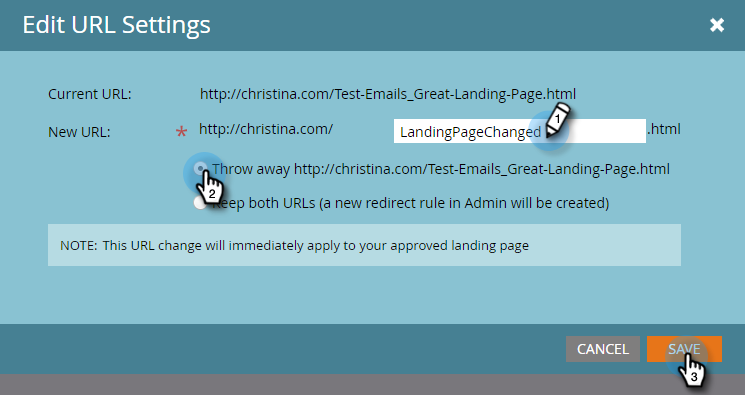

# De URL van de landingspagina wijzigen {#change-the-landing-page-url}

U kunt de URL van een bestemmingspagina wijzigen. Hierdoor kan de URL gemakkelijker onthouden worden en kan SEO worden verbeterd.

1. Selecteer de openingspagina. Klik op **Handelingen voor bestemmingspagina** vervolgkeuzelijst, blader naar **URL-gereedschappen** en selecteer **URL-instellingen bewerken**.

   

1. Voer de **Nieuwe URL** in, kies de oude URL verwijderen of omgeleid en klik op **Opslaan**.

   

   >[!NOTE]
   >
   >Als u besluit dat u beide URL&#39;s wilt behouden, wordt automatisch een omleidingsregel gemaakt. Meer informatie over [URL-omleidingen](/help/marketo/product-docs/demand-generation/landing-pages/personalizing-landing-pages/redirect-a-url-path.md).
