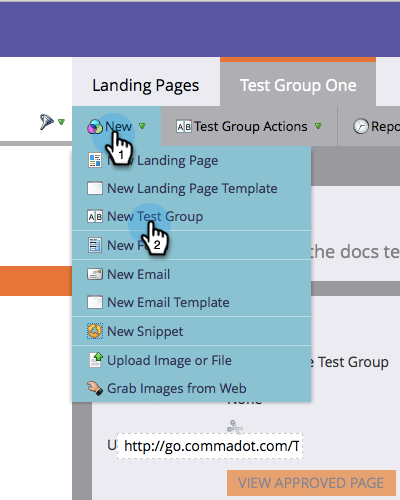

# Testgroep voor landingspagina klonen {#cloning-a-landing-page-test-group}

Vanuit [!UICONTROL Design Studio] kunt u een testgroep met landingspagina&#39;s zoeken en dupliceren.

1. Klik met de rechtermuisknop op een niet-goedgekeurde pagina. Selecteer **[!UICONTROL Clone]**.

   

1. Geef deze gekloonde pagina een nieuwe **[!UICONTROL Name]** . De gekloonde pagina&#39;s worden onder aan de huidige map weergegeven.

   

1. Maak nu een nieuwe testgroep door op **[!UICONTROL New]** te klikken en **[!UICONTROL New Test Group]** te kiezen.

   

1. Voer in het dialoogvenster Nieuwe bestemmingspagina&#39;s maken de nieuwe testgroep **[!UICONTROL Name]** in.

   

1. Selecteer onder aan het dialoogvenster de gekloonde pagina&#39;s in de lijst **[!UICONTROL Available Landing Pages]** en klik op de pijl die naar rechts wijst om deze in de lijst **[!UICONTROL Tested Landing Pages]** op te nemen. Doe dit voor alle bestemmingspagina&#39;s u in deze groep wilt.

   

1. Klik op **[!UICONTROL Create]** als u klaar bent.

   

1. Wanneer u klaar bent om de testgroep te lanceren, klik de groep in de boom met de rechtermuisknop aan en kies **[!UICONTROL Approve Test Group]**.

   

   De groep zal nu actief bezoeken en vormvoltooiing volgen zodat u kunt zien welke het landen pagina het best presteert.
