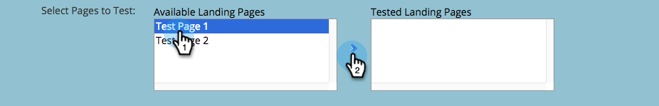

# Testgroep voor landingspagina klonen {#cloning-a-landing-page-test-group}

Van de Studio van het Ontwerp, kunt u een het landen van de paginatestgroep vinden en dupliceren.

1. Klik met de rechtermuisknop op een niet-goedgekeurde pagina. Selecteren **Klonen**.

   

1. Deze gekloonde pagina een nieuwe pagina geven **Naam**. De gekloonde pagina&#39;s worden onder aan de huidige map weergegeven.

   

1. Maak nu een nieuwe testgroep door op **Nieuw** en plukken **Nieuwe testgroep**.

   

1. Voer in het dialoogvenster Nieuwe bestemmingspagina&#39;s maken de nieuwe testgroep in **Naam**.

   

1. Selecteer onder aan het dialoogvenster de gekloonde pagina&#39;s in het dialoogvenster **Beschikbare bestemmingspagina&#39;s** en klik op de pijl die naar rechts wijst om deze in de lijst op te nemen **Geteste bestemmingspagina&#39;s**. Doe dit voor alle bestemmingspagina&#39;s u in deze groep wilt.

   

1. Als u klaar bent, klikt u op **Maken**.

   

1. Wanneer u klaar bent om de testgroep te lanceren, klik de groep in de boom met de rechtermuisknop aan en kies **Testgroep goedkeuren**.

   

   De groep zal nu actief bezoeken en vormvoltooiing volgen zodat u kunt zien welke het landen pagina het best presteert.
