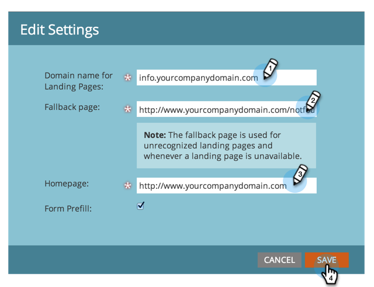

# De URL&#39;s van uw bestemmingspagina aanpassen met een CNAME {#customize-your-landing-page-urls-with-a-cname}

Hoewel Marketo uw landingspagina&#39;s host, kan de URL volledig worden aangepast. Hoe ziet het eruit zonder een CNAME:

`https://na-sj02.marketo.com/lp/mktodemoaccount126/UnsubscribePage.html`

De manier waarop het eruit moet zien:

`https://go.YourCompany.com/UnsubscribePage.html`

## Een CNAME kiezen {#choose-a-cname}

Kies een woord om aan het begin van de URL te gaan voor de bestemmingspagina&#39;s. Het is maar één woord en zou relatief kort moeten zijn. Voorbeelden:

* go.YourCompany.com/NameOfPage.html
* info.YourCompany.com/NameOfPage.html
* pages.YourCompany.com/NameOfPage.html

Het ene woord (plus YourCompany.com) wordt een CNAME genoemd. U hebt dit later nodig, dus noteer het.

## Je Munchkin-id zoeken {#find-your-munchkin-id}

1. Ga naar het **Admin** gebied.

   

1. Klik **Mijn Rekening**.

   

   >[!NOTE]
   >
   >**Vereiste Bevoegdheden Admin**

1. Blader omlaag naar &quot;Ondersteuningsinformatie&quot; en kopieer uw Munchkin-id.

   

## Verzoek verzenden naar IT {#send-request-to-it}

Vraag uw personeel van IT om volgende CNAME in te stellen: (Vervang het woord [ CNAME ] en [ identiteitskaart van Munchkin ] met de tekst van de vorige stap.)

[ .YourCompany.com ] identiteitskaart van Munchkin [ .mktoweb.com]

## CNAME-instelling voltooien {#complete-cname-setup}

1. Zodra uw IT CNAME heeft gecreeerd, ga naar het **Admin** gebied.

   

1. Klik **het Bestaan Pagina&#39;s**.

   

1. Onder de **sectie van Montages**, geeft de klik **&#x200B;**&#x200B;uit.

   

1. Voer uw CNAME in **[!UICONTROL Domain name for Landing Pages]** in, voer uw **[!UICONTROL Fallback page]** in, voer uw **[!UICONTROL Homepage]** in en klik op **[!UICONTROL Save]** .

   

>[!NOTE]
>
>De fallback-pagina is de pagina waarnaar de leads worden omgeleid als de Marketo Landing Page niet beschikbaar is.

Mooi werk! De landingspagina&#39;s zijn nu gecodeerd met uw bedrijfsdomein.
