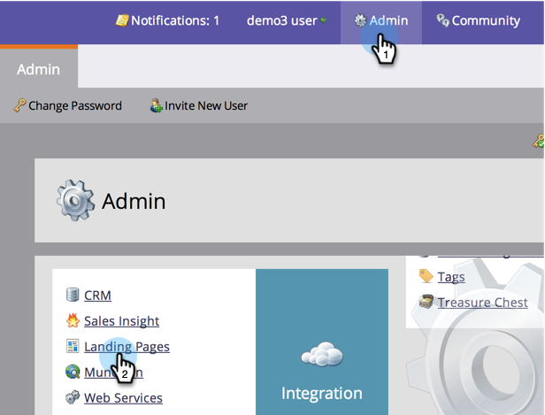
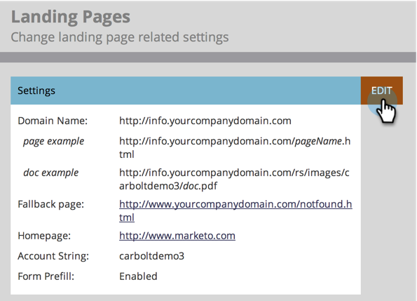

# Pas Uw het Bestaan Pagina URLs met een CNAME {#customize-your-landing-page-urls-with-a-cname} aan

Hoewel Marketo uw landingspagina&#39;s host, kan de URL volledig worden aangepast. Hoe ziet het eruit zonder een CNAME:

`https://na-sj02.marketo.com/lp/mktodemoaccount126/UnsubscribePage.html`

De manier waarop het eruit moet zien:

`https://go.YourCompany.com/UnsubscribePage.html`

## Kies een CNAME {#choose-a-cname}

Kies een woord om aan het begin van de URL te gaan voor de bestemmingspagina&#39;s. Het is maar één woord en zou relatief kort moeten zijn. Voorbeelden:

* go.YourCompany.com/NameOfPage.html
* info.YourCompany.com/NameOfPage.html
* pages.YourCompany.com/NameOfPage.html

Het ene woord (plus YourCompany.com) wordt een CNAME genoemd. U hebt dit later nodig, dus noteer het.

## Uw accounttekenreeks {#find-your-account-string} zoeken

1. Ga naar **Admin** en klik op **Landing Pages**.

   

   >[!NOTE]
   >
   >**Beheerdersmachtigingen vereist**

1. Kopieer onder het tabblad **Landing** **Pagina&#39;s** de **Account** **String** vanuit de sectie **Settings**.

   

1. U zult later ook nodig hebben, dus maak er een notitie van.

## Verzoek verzenden naar IT {#send-request-to-it}

Vraag uw personeel van IT om volgende CNAME te installeren: (Vervang het woord [CNAME] en [ACCOUNT STRING] door de tekst uit de vorige stap.)

[CNAME].YourCompany.com >  [ACCOUNT STRING].mktoweb.com

## Volledige CNAME-instelling {#complete-cname-setup}

1. Zodra uw IT CNAME heeft gecreeerd, ga naar **Admin** en klik op **Landing Pages**.

   

1. Klik onder de sectie **Instellingen** op **Bewerken**.

   

1. Voer uw CNAME in **Domeinnaam voor Landing Pages** in, voer uw **Fallback-pagina** in, voer uw **Homepage** in en klik **Save**.

   

>[!NOTE]
>
>De fallback-pagina is de pagina waarnaar de leads worden omgeleid als de bestemmingspagina van Marketo niet beschikbaar is.

Mooi werk! De landingspagina&#39;s zijn nu gecodeerd met uw bedrijfsdomein.
