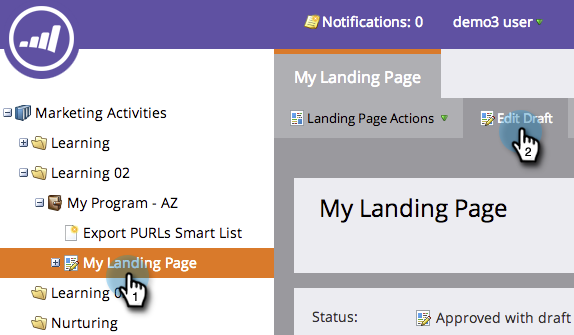

# Titel en metagegevens van bestemmingspagina bewerken {#edit-landing-page-title-and-metadata}

Marketo staat u toe om uw het landen pagina [&#x200B; metatags voor SEO doeleinden &#x200B;](https://www.w3schools.com/tags/tag_meta.asp) uit te geven evenals het `<head>` gedeelte van HTML aan te passen.

1. Selecteer een openingspagina en klik op **[!UICONTROL Edit Draft]** .

   

   >[!NOTE]
   >
   >De ontwerpfunctie voor de bestemmingspagina wordt in een nieuw venster geopend.

1. Klik onder **[!UICONTROL Landing Page Actions]** op **[!UICONTROL Edit Page Meta Tags]** .

   

1. Voer de **[!UICONTROL Title]** , **[!UICONTROL Keywords]** en **[!UICONTROL Description]** voor de pagina in. Selecteer de gewenste optie **[!UICONTROL Robots]** en voer aangepaste inhoud in die u voor de sectie HTML `<head>` wilt gebruiken. Klik op **[!UICONTROL Save]**.

   

   >[!TIP]
   >
   >**wat [&#x200B; robots &#x200B;](https://www.robotstxt.org/meta.html) betekent?**
   >
   >**index**: de pagina is doorzoekbaar op het Web. **volgt**: de onderzoeksmotoren kunnen verbindingen op geïndexeerde pagina&#39;s volgen.

1. Bewerk de labels op elk gewenst moment en keur de bestemmingspagina goed.
