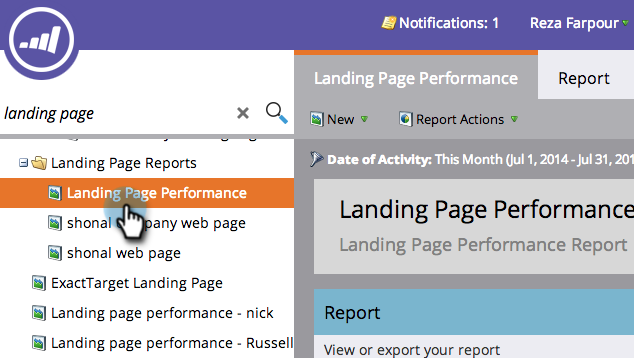

# Een prestatierapport voor de bestemmingspagina filteren {#filter-a-landing-page-performance-report}

Focus uw [ het landen rapport van de paginaprestaties ](/help/marketo/product-docs/demand-generation/landing-pages/understanding-landing-pages/landing-page-performance-report.md) op het landen van pagina&#39;s in uw programma&#39;s (lokale activa), op die in [!UICONTROL Design Studio] (globale activa), of op die die zijn gearchiveerd.

1. Ga naar **[!UICONTROL Analytics]** (of **[!UICONTROL Marketing Activities]** ).

   

1. Selecteer het rapport van de bestemmingspagina in de navigatiestructuur.

   

1. Klik op de tab **[!UICONTROL Setup]** en sleep in een filter.

   

   * **[!UICONTROL Design Studio Landing Pages]:** Algemene elementen, beheerd in de [!UICONTROL Design Studio] .
   * **[!UICONTROL Marketing Activities Landing Pages]:** Lokale elementen in programma&#39;s op het tabblad [!UICONTROL Marketing Activities] .
   * **[!UICONTROL Archived Landing Pages]:** Inactieve, gepensioneerde bestemmingspagina&#39;s.

1. Kies de mappen en specifieke bestemmingspagina&#39;s die u in uw rapport wilt opnemen.

   

   >[!TIP]
   >
   >Als u een map selecteert, bevat uw rapport alles wat de map bevat op het moment dat het rapport wordt uitgevoerd.

1. Je bent klaar! Klik op het tabblad **[!UICONTROL Report]** om uw gefilterde rapport te bekijken.

   
