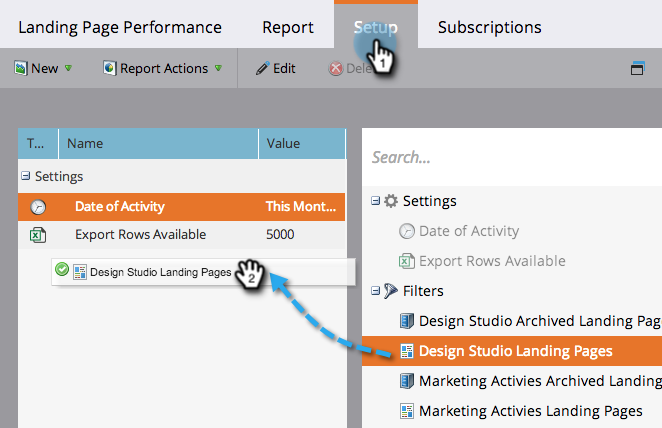

# Een prestatierapport voor de bestemmingspagina filteren {#filter-a-landing-page-performance-report}

Focus op uw [prestatierapport van bestemmingspagina](/help/marketo/product-docs/demand-generation/landing-pages/understanding-landing-pages/landing-page-performance-report.md) op het landen van pagina&#39;s in uw programma&#39;s (lokale activa), op die in Design Studio (globale activa), of op die die zijn gearchiveerd.

1. Ga naar **Analyse** (of **Marketingactiviteiten**).

   

1. Selecteer het rapport van de bestemmingspagina in de navigatiestructuur.

   

1. Klik op de knop **Instellen** en sleep in een filter.

   

   * **Openingspagina&#39;s van Design Studio:** Globale activa, die in de Studio van het Ontwerp worden beheerd.
   * **Openingspagina&#39;s voor marketingactiviteiten:** Lokale elementen in programma&#39;s op het tabblad Marketingactiviteiten.
   * **Gearchiveerde bestemmingspagina&#39;s:** Inactieve, gepensioneerde bestemmingspagina&#39;s.

1. Kies de mappen en specifieke bestemmingspagina&#39;s die u in uw rapport wilt opnemen.

   

   >[!TIP]
   >
   >Als u een map selecteert, bevat uw rapport alles wat de map bevat op het moment dat het rapport wordt uitgevoerd.

1. Je bent klaar! Klik op de knop **Rapport** om uw gefilterde rapport te bekijken.

   
