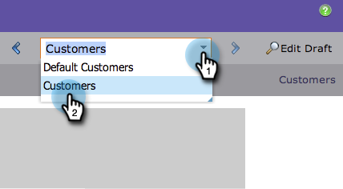

# Een voorvertoning van een bestemmingspagina weergeven met dynamische inhoud {#preview-a-landing-page-with-dynamic-content}

Geef een voorvertoning van de openingspagina weer nadat u dynamische inhoud hebt toegevoegd om ervoor te zorgen dat alles er goed uitziet.

>[!PREREQUISITES]
>
>* [&#x200B; Dynamische Inhoud van het Gebruik in een het landen Pagina &#x200B;](/help/marketo/product-docs/demand-generation/landing-pages/personalizing-landing-pages/use-dynamic-content-in-a-landing-page.md)
>* [&#x200B; Voorproef een het Bestaan Pagina &#x200B;](/help/marketo/product-docs/demand-generation/landing-pages/landing-page-actions/preview-a-landing-page.md)

1. Selecteer een openingspagina en klik op **[!UICONTROL Preview Page]** .

   

1. Klik drop-down en selecteer a **Segment** om het te voorproef.

   

Geweldig! U kunt er nu voor zorgen dat de bestemmingspagina&#39;s naar wens werken, zodat u ze in alle segmenten kunt gebruiken.
