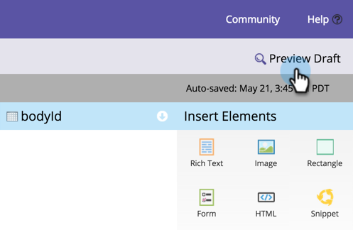

# Een voorvertoning van een bestemmingspagina weergeven {#preview-a-landing-page}

U wilt waarschijnlijk zien hoe de landingspagina eruitziet voordat u deze live maakt.

## Een voorvertoning van een bestemmingspagina weergeven {#preview-a-landing-page-1}

1. Selecteer een openingspagina en klik op **[!UICONTROL Preview Page]** .

   

   >[!NOTE]
   >
   >Het concept is de versie waaraan u werkt, niet de live versie die klanten zien.

1. U kunt ook met de rechtermuisknop op de landingspagina klikken en **[!UICONTROL Preview]** selecteren.

   

## Een concept van een openingspagina voorvertonen {#preview-a-landing-page-draft}

1. Klik met de rechtermuisknop op een goedgekeurde bestemmingspagina met een conceptversie en klik op **[!UICONTROL Preview Draft]** .

   

## Concepten van openingspagina&#39;s voorvertonen tijdens bewerken {#preview-a-landing-page-draft-while-editing}

1. Selecteer een openingspagina en klik op **[!UICONTROL Edit Draft]** .

   

1. U kunt op elk gewenst moment tijdens uw werk in de editor voor de bestemmingspagina op **[!UICONTROL Preview Draft]** klikken.

   

1. U kunt snel terugkeren naar het bewerken door op **[!UICONTROL Edit Draft]** te klikken.

   

Mooi werk! Nu weet u hoe u een voorvertoning van de openingspagina&#39;s kunt weergeven.
