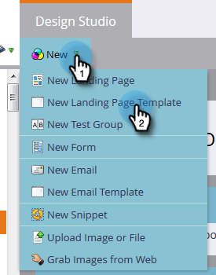

# Een sjabloon voor vrije bestemmingspagina maken {#create-a-free-form-landing-page-template}

Voor vrije-vormbestemmingspagina&#39;s is minder technische kennis nodig dan voor de door hen geleide tegenhangers. Volg onderstaande stappen om een sjabloon voor toekomstige bestemmingspagina&#39;s te maken.

1. Ga naar **[!UICONTROL Design Studio]** .

   

1. Klik op **[!UICONTROL New]** en selecteer vervolgens **[!UICONTROL New Landing Page Template]** .

   

1. Kies de map en geef de sjabloon een naam. Vrije vorm is de standaardbewerkingsmodus. Klik dus na de naam van de sjabloon op **[!UICONTROL Create]** .

   

1. De sjabloon moet op een nieuw tabblad worden geopend. Deze kan nu worden bewerkt aan iedereen die bekend is met CSS/HTML.

   

   >[!NOTE]
   >
   >Marketo Support is niet ingesteld als hulp bij het oplossen van problemen met aangepaste HTML. Voor hulp van HTML raadpleegt u een webontwikkelaar.

1. Wanneer u klaar bent met het maken van bewerkingen, klikt u op **[!UICONTROL Template Actions]** en selecteert u **[!UICONTROL Approve and Close]** .

   

   U hebt nu een nieuwe sjabloon voor een openstaande bestemmingspagina!

   >[!NOTE]
   >
   >Selecteer **[!UICONTROL Disable Munchkin Tracking]** als u wilt voorkomen dat formulieren vooraf worden ingevuld, of als u alleen het webgedrag op een bepaalde pagina wilt bijhouden.\
   >Selecteer **[!UICONTROL Validate Mobile Compatibility]** om ervoor te zorgen dat de code compatibel is met mobiele apparaten.

   >[!MORELIKETHIS]
   >
   >* [ creeer een Vrije-Vorm het Landen Pagina ](/help/marketo/product-docs/demand-generation/landing-pages/free-form-landing-pages/create-a-free-form-landing-page.md)
   >* [ creeer een Geleide het Landen Malplaatje van de Pagina ](/help/marketo/product-docs/demand-generation/landing-pages/landing-page-templates/create-a-guided-landing-page-template.md)
   >* [ Begrijpend Vrije-vorm vs Geleide het Landen Pagina&#39;s ](/help/marketo/product-docs/demand-generation/landing-pages/understanding-landing-pages/understanding-free-form-vs-guided-landing-pages.md)
