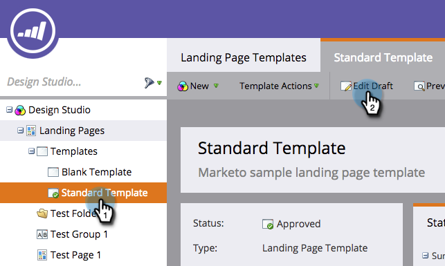

# Een Marketo-sjabloon voor openingspagina bewerken {#edit-a-marketo-landing-page-template}

U kunt elke sjabloon van een bestemmingspagina bewerken in Marketo.

1. Ga naar **[!UICONTROL Design Studio]** .

   

1. Vouw **[!UICONTROL Landing Pages]** uit om de sjablonen weer te geven.

   

1. Selecteer de **[!UICONTROL Template]** die u wilt bewerken. Klik op **[!UICONTROL Edit Draft]**.

   

   Gereed! Nu kunt u CSS van het malplaatje uitgeven en volledige controle over zijn verschijning en lay-out hebben.

   >[!NOTE]
   >
   >Wanneer u een sjabloon voor een bestemmingspagina bewerkt, wordt met behulp van die sjabloon een concept van een ander element van de bestemmingspagina gemaakt.
