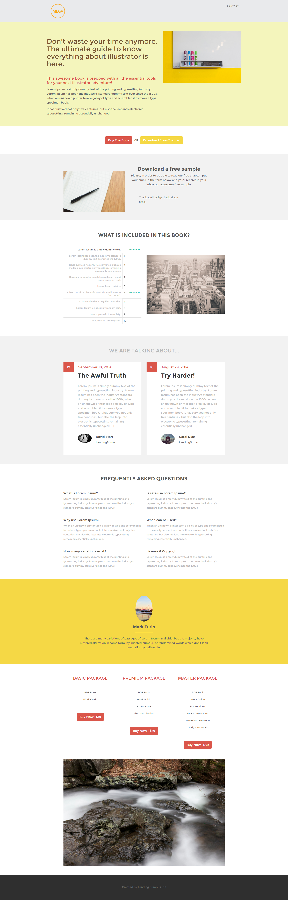

# Sjabloon 12A {#template-12a}

Klik met de rechtermuisknop aan [&#x200B; downloadmalplaatje 12A &#x200B;](https://experienceleague.adobe.com/landing/marketo/lp-templates/template-12a.html?lang=nl-NL)

Deze sjabloon bevat de volgende inhoud:

* Een koptekst (optioneel)
* Een primaire sectie

   * Inclusief hoofdtitel, hoofdtekst en hoofdafbeelding

* Zes carrosseriesegmenten (optioneel)
* Voettekst (optioneel)

**klik hieronder met de rechtermuisknop aan om dit malplaatje te downloaden:**

[&#x200B; Malplaatje 12A.html &#x200B;](https://experienceleague.adobe.com/landing/marketo/lp-templates/template-12a.html?lang=nl-NL)
