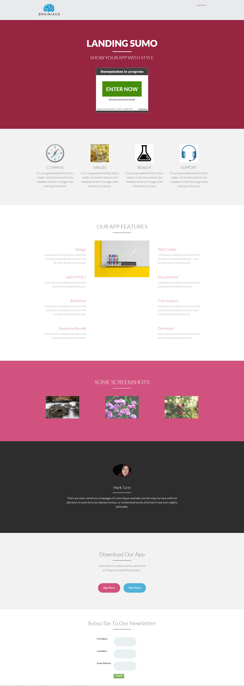

# Sjabloon 14-D {#template-d}

[Sjabloon 14-D downloaden](http://docs.marketo.com/download/attachments/9437810/template-14d.html?version=1&amp;modificationdate=1438980314000&amp;api=v2)

Deze sjabloon bevat de volgende inhoud:

* Een koptekst (optioneel)
* Een primaire sectie

   * omvat hoofdtitel, hoofdtekst en overtrekkingen

* Vijf carrosseriesegmenten (optioneel)
* Voettekst (optioneel)

Klik hieronder om deze sjabloon te downloaden:

[Template14-D.html](http://docs.marketo.com/download/attachments/9437810/template-14d.html?version=1&amp;modificationdate=1438980314000&amp;api=v2)
