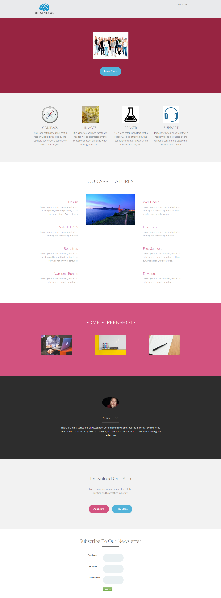

# Sjabloon 14-E {#template-e}

[Sjabloon 14-E downloaden](http://docs.marketo.com/download/attachments/9437813/template-14e.html?version=1&amp;modificationdate=1438980353000&amp;api=v2)

Deze sjabloon bevat de volgende inhoud:

* Een koptekst (optioneel)
* Een primaire sectie

   * bevat hoofdafbeelding en meer informatie over de knop

* Vijf carrosseriesegmenten (optioneel)
* Voettekst (optioneel)

Klik hieronder om deze sjabloon te downloaden:

[Template14-E.html](http://docs.marketo.com/download/attachments/9437813/template-14e.html?version=1&amp;modificationdate=1438980353000&amp;api=v2)
