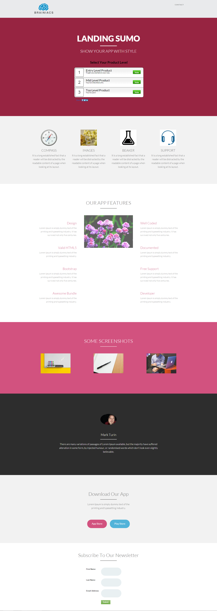

# Sjabloon 14C {#template-14c}

Klik met de rechtermuisknop om [downloadsjabloon 14C](https://experienceleague.adobe.com/landing/marketo/lp-templates/template-14c.html?lang=nl-NL)

Deze sjabloon bevat de volgende inhoud:

* Een koptekst (optioneel)
* Een primaire sectie

   * omvat hoofdtitel, hoofdtekst en enquête

* Hoofdtekst van de machine (optioneel)
* Voettekst (optioneel)

**Klik hieronder met de rechtermuisknop om deze sjabloon te downloaden:**

[Sjabloon 14C.html](https://experienceleague.adobe.com/landing/marketo/lp-templates/template-14c.html?lang=nl-NL)
