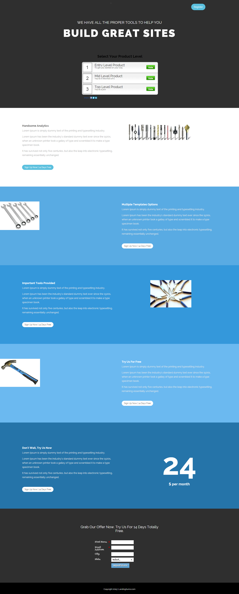

# Sjabloon 15-C {#template-c}

Klik met de rechtermuisknop om [Sjabloon 15-C](http://docs.marketo.com/download/attachments/9437822/template-15c.html?version=1&amp;modificationdate=1438980471000&amp;api=v2) te downloaden

Deze sjabloon bevat de volgende inhoud:

* Een primaire sectie

   * omvat hoofdtitel en enquête

* Vijf carrosseriesegmenten (optioneel)
* Voettekst (optioneel)

Klik hieronder met de rechtermuisknop om deze sjabloon te downloaden:

[Template15-C.html](http://docs.marketo.com/download/attachments/9437822/template-15c.html?version=1&amp;modificationdate=1438980471000&amp;api=v2)
