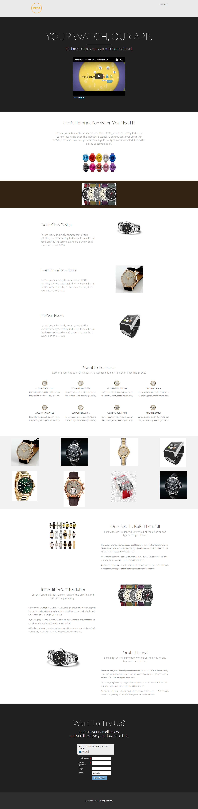

# Sjabloon 16B {#template-16b}

Klik met de rechtermuisknop aan [&#x200B; downloadmalplaatje 16B &#x200B;](https://experienceleague.adobe.com/landing/marketo/lp-templates/template-16b.html?lang=nl-NL)

Deze sjabloon bevat de volgende inhoud:

* Een koptekst (optioneel)
* Een primaire sectie

   * Inclusief hoofdtitel en video

* Zes carrosseriesegmenten

**klik hieronder met de rechtermuisknop aan om dit malplaatje te downloaden:**

[&#x200B; Malplaatje 16B.html &#x200B;](https://experienceleague.adobe.com/landing/marketo/lp-templates/template-16b.html?lang=nl-NL)
