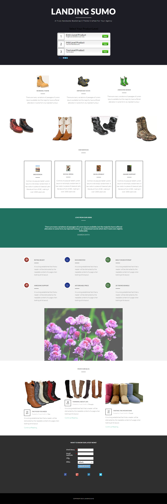

# Sjabloon 17C {#template-17c}

Klik met de rechtermuisknop aan [&#x200B; downloadmalplaatje 17C &#x200B;](https://experienceleague.adobe.com/landing/marketo/lp-templates/template-17c.html?lang=nl-NL)

Deze sjabloon bevat de volgende inhoud:

* Een primaire sectie

   * omvat de hoofdtitel, hoofdtekst en een opiniepeiling

* Zes carrosseriesegmenten (optioneel)
* Voettekst (optioneel)

**klik hieronder met de rechtermuisknop aan om dit malplaatje te downloaden:**

[&#x200B; Malplaatje 17C.html &#x200B;](https://experienceleague.adobe.com/landing/marketo/lp-templates/template-17c.html?lang=nl-NL)
