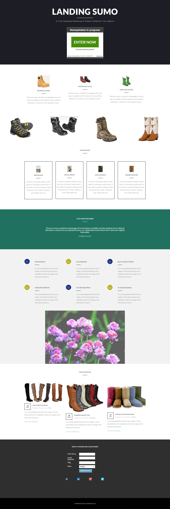

# Sjabloon 17-D {#template-17d}

[Sjabloon 17-D downloaden](https://experienceleague.adobe.com/landing/marketo/lp-templates/template-17d.html)

Deze sjabloon bevat de volgende inhoud:

* Een primaire sectie

   * omvat hoofdtitel, hoofdtekst en overtrekkingen

* Zes carrosseriesegmenten (optioneel)
* Voettekst (optioneel)

**Klik hieronder om deze sjabloon te downloaden:**

[Sjabloon 17-D.html](https://experienceleague.adobe.com/landing/marketo/lp-templates/template-17d.html)
