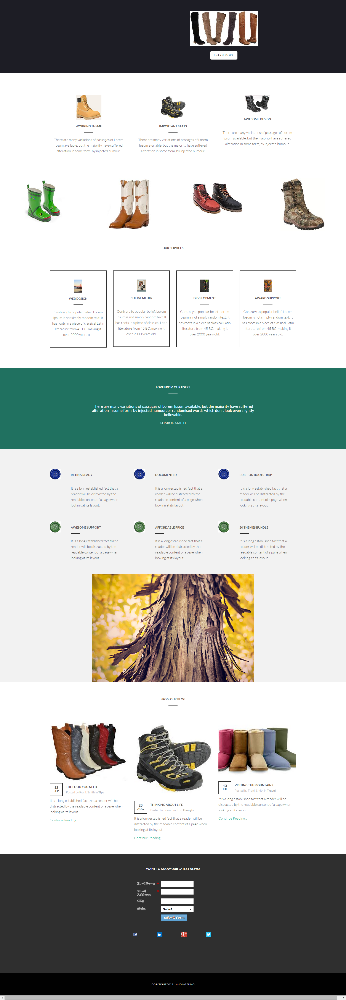

# Sjabloon 17E {#template-17e}

Klik met de rechtermuisknop aan [&#x200B; downloadmalplaatje 17E &#x200B;](https://experienceleague.adobe.com/landing/marketo/lp-templates/template-17e.html)

Deze sjabloon bevat de volgende inhoud:

* Een primaire sectie

   * inclusief hoofdafbeelding en knop

* Zes carrosseriesegmenten (optioneel)
* Voettekst (optioneel)

**klik hieronder met de rechtermuisknop aan om dit malplaatje te downloaden:**

[&#x200B; Malplaatje 17E.html &#x200B;](https://experienceleague.adobe.com/landing/marketo/lp-templates/template-17e.html)
